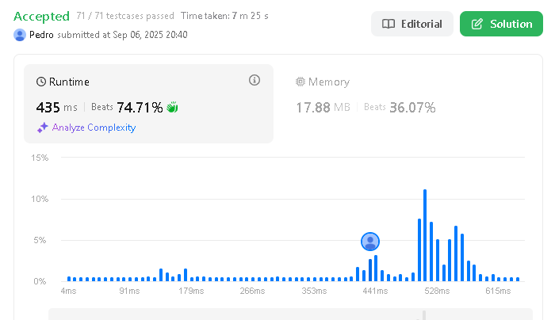
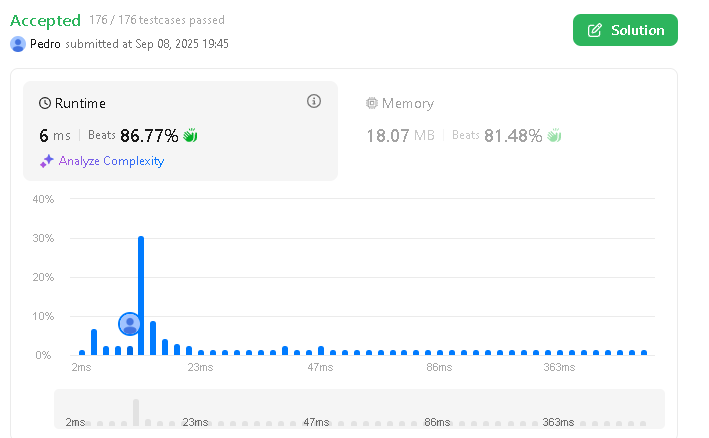

# AlgoritmoBusca_LeetCodQuest

**Conteúdo da Disciplina**: Algoritmos de Busca  

## Alunos

| Matrícula  | Aluno                       |
| ---------- | --------------------------- |
| 20/0026151 | Pedro Henrique F. Nunes     |

## Sobre

<!-- Descreva os objetivos do seu projeto e como ele funciona. -->

### Escolha da plataforma

Para este trabalho de Algoritmos de Busca, opitamos por utilizar um juiz eletrônico para resolver exercícios relacionados aos conceitos estudados em aula. Desta forma, escolhemos o LeetCode, pois ele oferece um vasto repositório de problemas de programação com níveis variados de dificuldade, cobrindo vários tópicos fundamentais em estruturas de dados e algoritmos. Além disso, a plataforma possui um sistema automático de avaliação que testa as submissões contra múltiplos casos de teste.

### Exercícios escolhidos

Conforme mencionado acima, esse projeto visa contemplar a resolução de alguns exercícios sobre os conteúdos acerca de Algoritmos de Busca. Foram definidas 3 questões a serem resolvidas, sendo três delas de nível difícil. Abaixo podemos identificar as questões que foram resolvidas dentro do juiz eletrônico LeetCode:

| Questão | Nome                                                                                                  | Dificuldade |
| ------- | ----------------------------------------------------------------------------------------------------- | ----------- |
|  668     | [Kth Smallest Number in Multiplication Table](https://leetcode.com/problems/kth-smallest-number-in-multiplication-table/description/) | Difícil     |
|   1293    |   [Shortest Path in a Grid with Obstacles Elimination](https://leetcode.com/problems/shortest-path-in-a-grid-with-obstacles-elimination/description/)                | Difícil     |
|  1553    |    [Minimum Number of Days to Eat N Oranges](https://leetcode.com/problems/minimum-number-of-days-to-eat-n-oranges/)     | Difícil       |

### Link para o vídeo de apresentação

## Screenshots

Segue abaixo Screenshots demonstrando que as soluções para os respectivos problemas foram aceitas em todos os testes de caso:

Questão 668 - Kth Smallest Number in Multiplication Table

Questão 1293 - Shortest Path in a Grid with Obstacles Elimination

Questão 1553 - Minimum Number of Days to Eat N Oranges

## Instalação

**Linguagem**: Python  

<!-- Descreva os pré-requisitos para rodar o seu projeto e os comandos necessários -->

### Uso

<!-- Explique como usar seu projeto caso haja algum passo a passo após o comando de execução. -->

A seguir, é explicado como qualquer pessoa pode copiar e testar os códigos presente neste repositório diretamente no LeetCode:

- _Acesse o site do LeetCode_:
  Para acessar a questão no LeetCode, vá para o site por qualquer um dos links na tabela Sobre. Para executar os testes de caso e identificar se a solução foi aceita, será necessário se cadastrar ou fazer login.

- _Copie o código do repositório_:
  Acesse a pasta deste repositório chamada AlgoritmoBusca, clique no número do exercício e copie o código referente à questão desejada.

- _Cole o código no editor do LeetCode_:
  No ambiente da questão, selecione a linguagem correta do código que foi utilizado para resolver a questão(por exemplo, Python ou C) e cole o código no editor online.

- _Execute e submeta_:
  Clique em “Run” para testar com os casos de exemplo ou em “Submit” para rodar todos os casos de teste oficiais do LeetCode.
